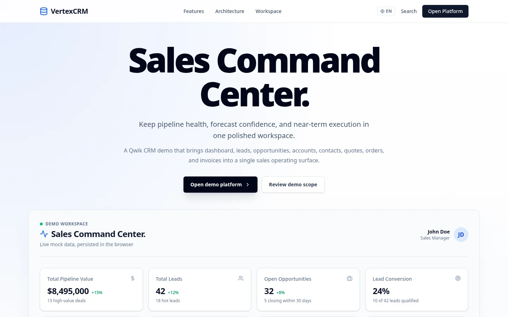
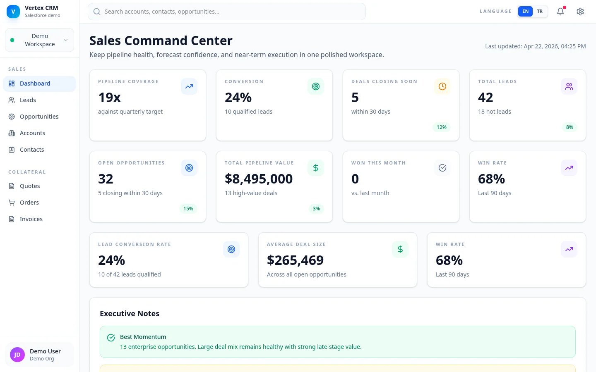
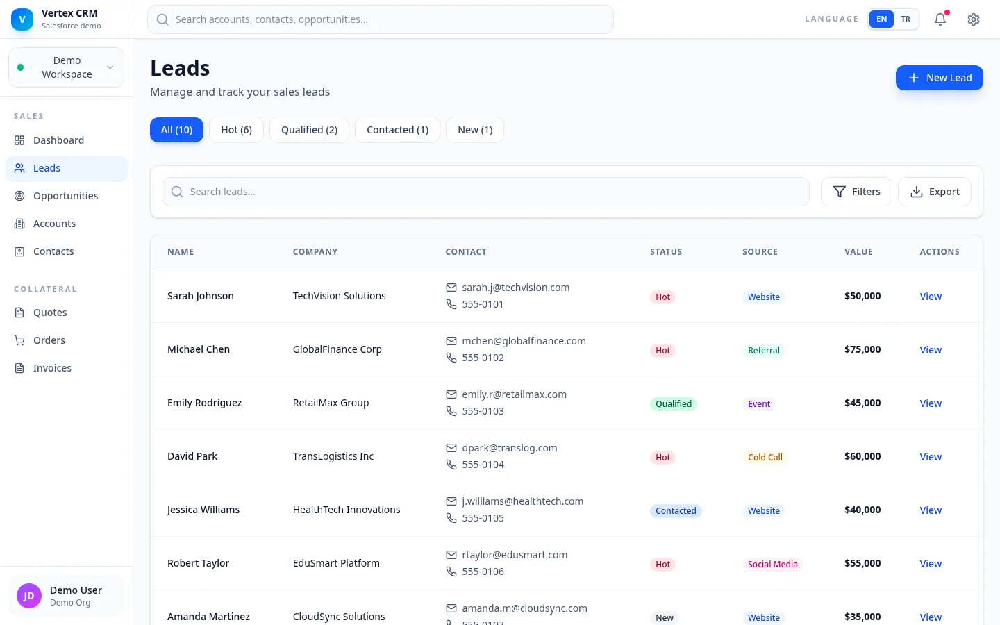
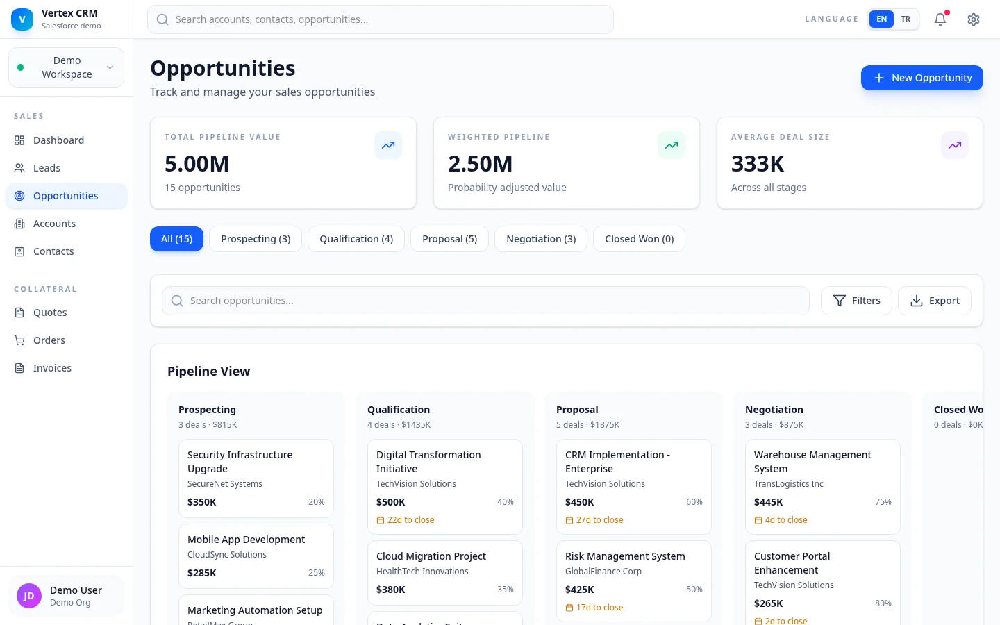
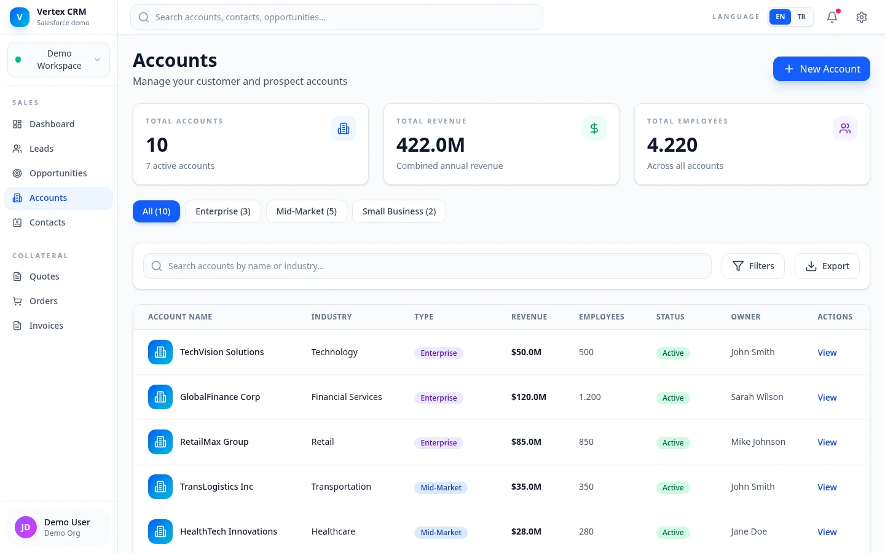
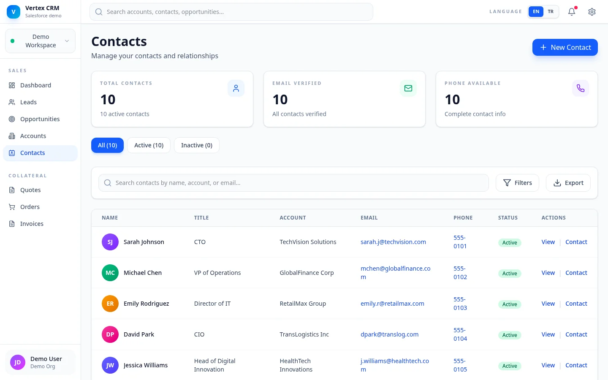
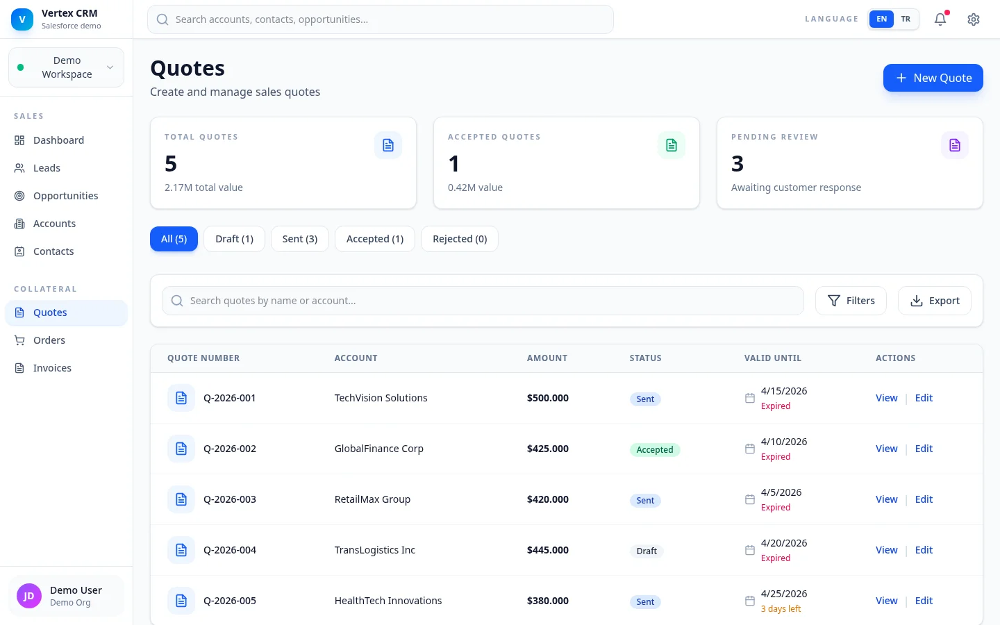
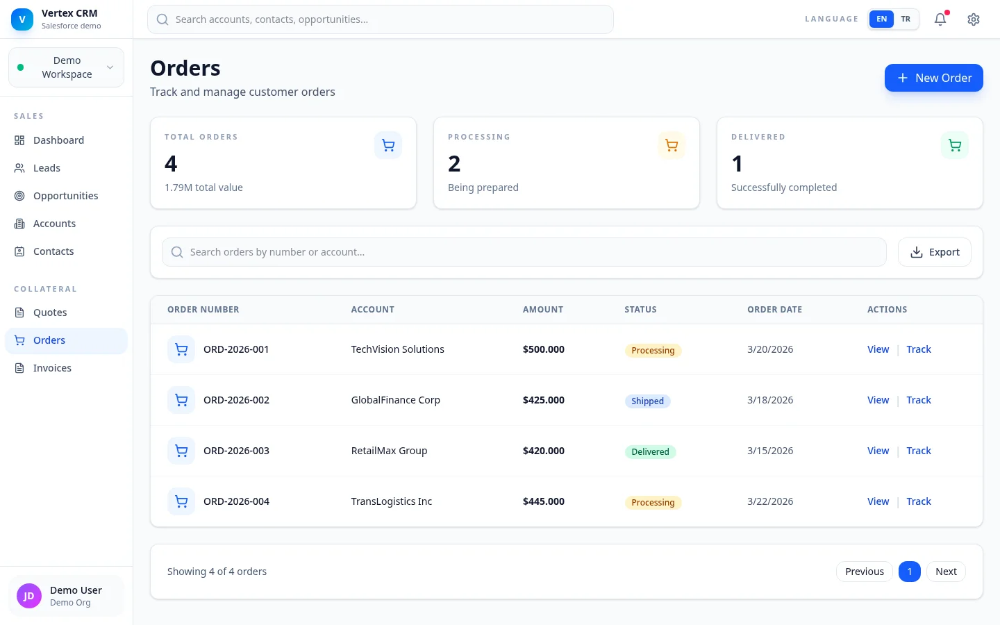
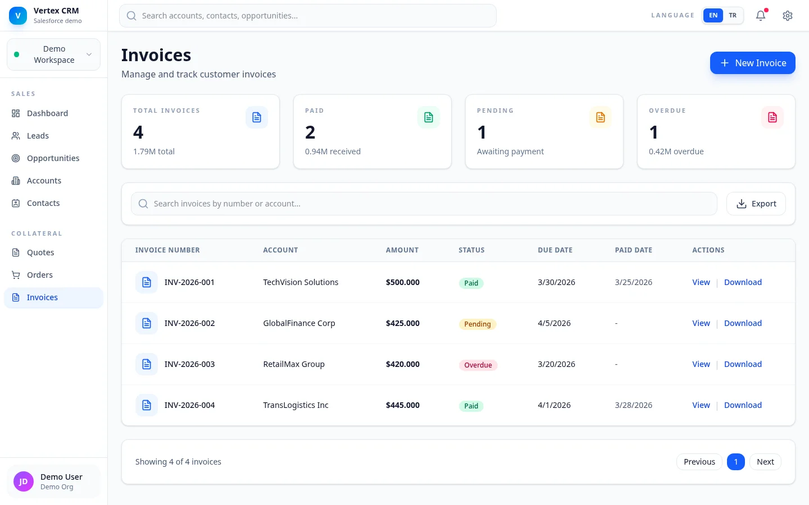
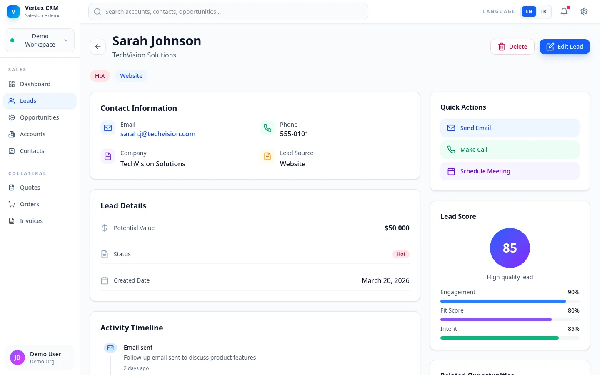

<div align="center">


# Salesforce CRM Demo

**Qwik tabanlı satış CRM workspace demosu** — leads, opportunities, accounts, contacts, quotes, orders ve invoices akışlarını tek dense panelde birleştirir. Resumable rendering ile sıfır JS hidrasyon.

[](#tech-stack)
[](https://vertex.lavescar.com.tr)
[](#license)

[**▸ Live demo**](https://vertex.lavescar.com.tr) · [**▸ Portfolyo**](https://lavescar.com.tr) · [**▸ Diğer demolar**](https://lavescar.com.tr/#projects)

</div>

---

<p align="center"></p>

## Genel bakış

Bu demo, klasik satış CRM akışının (lead → opportunity → quote → order → invoice) tek SPA içinde nasıl modellenebileceğini gösteren bir ürün UI prototipidir. Qwik'in resumable yaklaşımı sayesinde ilk sayfa neredeyse sıfır JS ile yüklenir; etkileşimli alanlar kullanıcı eylemine göre lazy şekilde aktive olur.

Tüm veri client-side mock'tur (`src/data/mock-data.ts`); gerçek bir backend gerektirmez. Cloudflare Pages Functions adapter'ı ile deploy edilir.

## Modüller

| Yüzey | İçerik |
|---|---|
| **Landing** | Ürün giriş, demo-access geçidi |
| **Dashboard** | Pipeline KPI, gelir trend grafiği, forecast tabloları |
| **Leads** | Liste + detay + edit, lead skoru, aşama akışı |
| **Opportunities** | Pipeline kanban, kazanç tahmini, döngü süresi |
| **Accounts** | Hesap listesi + ilişkili kontak/fırsat özeti |
| **Contacts** | Kişi rehberi, çoklu seçim, etiket |
| **Quotes** | Teklif listesi + statü |
| **Orders** | Sipariş takibi, durum geçişleri |
| **Invoices** | Fatura takibi, ödeme durumu |
| **Lead Detail** | Tek kart aktivite kronolojisi + birleşik bilgi paneli |

## Tech stack

| Layer | Technology |
|---|---|
| Framework | Qwik + Qwik City |
| Build | Vite + TypeScript |
| Styling | Tailwind CSS |
| Adapter | `@builder.io/qwik-city/adapters/cloudflare-pages` |
| Runtime | Cloudflare Pages Functions (`_worker.js`) |
| Mock data | `src/data/mock-data.ts` |
| Charts | Apache ECharts (revenue trend) |

## Ekran görüntüleri

<table>
  <tr>
    <td></td>
    <td></td>
  </tr>
  <tr>
    <td></td>
    <td></td>
  </tr>
  <tr>
    <td></td>
    <td></td>
  </tr>
  <tr>
    <td></td>
    <td></td>
  </tr>
  <tr>
    <td colspan="2"></td>
  </tr>
</table>

## Hızlı başlangıç

```bash
git clone https://github.com/Lavescar-dev/salesforce-crm-demo.git
cd salesforce-crm-demo

npm install
npm run dev -- --host 0.0.0.0     # → http://localhost:5173
```

## Build & verify

```bash
npm run fmt.check
npm run build.types
npm run lint
npm run build              # → dist/

# Smoke test bir preview URL'ini:
npm run smoke:routes -- https://<preview-url>
```

## Cloudflare Pages

Qwik City Cloudflare Pages adapter'ı yapılandırılmış. Önerilen Pages ayarları:

| Field | Value |
|---|---|
| Framework preset | `None` |
| Build command | `npm ci && npm run build` |
| Build output directory | `dist` |
| Node version | `20.19.0` (`.node-version` ya da `NODE_VERSION`) |
| Compatibility flags | `nodejs_compat` |
| Compatibility date | `wrangler.toml`'da pinned |

Build çıktısı:

- `dist/_worker.js`
- `dist/_routes.json`
- `dist/assets/*`

Doğrudan Wrangler deploy:

```bash
# Production
npm run deploy -- --project-name <cloudflare-pages-project>

# Preview branch
npm run deploy -- --project-name <cloudflare-pages-project> --branch preview
```

## Rotalar

| Path | Açıklama |
|---|---|
| `/` | Ürün landing |
| `/demo-access` | Guided demo geçidi |
| `/dashboard` | Sales dashboard |
| `/leads`, `/leads/:id`, `/leads/:id/edit` | Lead CRUD |
| `/opportunities` | Pipeline |
| `/accounts` | Hesap listesi |
| `/contacts` | Kişi rehberi |
| `/quotes`, `/orders`, `/invoices` | Belge akışları |

## Notlar

- Mock data — `src/data/mock-data.ts`
- Shared shell + navigation — `src/routes/layout.tsx`
- Public intro `/demo-access` üzerinden korumalı workspace rotalarına geçiyor

## License

MIT © 2026 Lavescar

> **Not:** Salesforce, Lightning ve ilgili görsel diller Salesforce.com Inc.'e aittir. Bu demo eğitim/portfolyo amaçlı bir UI taklididir; resmi Salesforce yazılımı veya endorsement içermez.

---

<sub>Built by **[Lavescar](https://lavescar.com.tr)** · [Portfolyo](https://lavescar.com.tr/#projects) · [efe@lavescar.com.tr](mailto:efe@lavescar.com.tr)</sub>
